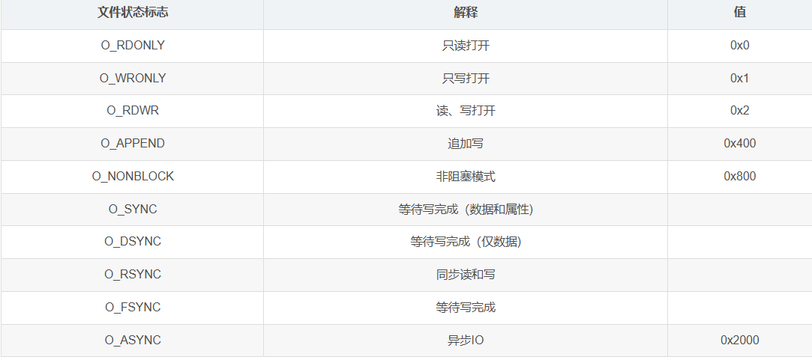

## IO调度模块
- (关于epoll与poll与select的区别) <https://www.bilibili.com/video/BV1qJ411w7du/?spm_id_from=333.337.search-card.all.click&vd_source=dadb73dfc7acd4644d18768715ab7946>
### epoll的API
```cpp
//头文件
#include <sys/epoll.h>  

//创建一个epoll实例 
//创建一个epoll fd，返回一个新的epoll文件描述符。
//参数size用于指定监听的文件描述符个数，但是在Linux 2.6.8之后的版本，该参数已经没有实际意义。传入一个大于0的值即可。
int epoll_create(int size);   

//控制epoll上的事件
//用于向epoll实例中添加、修改或删除关注的文件描述符和对应事件
//epfd：epoll文件描述符，通过epoll_create函数创建获得。
//op：操作类型，可以是以下三种取值之一：
//EPOLL_CTL_ADD：将文件描述符添加到epoll实例中。
//EPOLL_CTL_MOD：修改已添加到epoll实例中的文件描述符的关注事件。
//EPOLL_CTL_DEL：从epoll实例中删除文件描述符。
//fd：要控制的文件描述符。
//event：指向epoll_event结构体的指针，用于指定要添加、修改或删除的事件。
//成功时返回0，表示操作成功。
//失败时返回-1，并设置errno错误码来指示具体错误原因。
int epoll_ctl(int epfd, int op, int fd, struct epoll_event *event);  
 
//阻塞等待事件发生
//epfd：epoll文件描述符，通过epoll_create函数创建获得。
//events：用于接收事件的epoll_event结构体数组。
//maxevents：events数组的大小，表示最多可以接收多少个事件。
//timeout：超时时间，单位为毫秒，表示epoll_wait函数阻塞的最长时间。常用的取值有以下三种：
//-1：表示一直阻塞，直到有事件发生。
//0：表示立即返回，不管有没有事件发生。
//> 0：表示等待指定的时间（以毫秒为单位），如果在指定时间内没有事件发生，则返回。
//成功时返回接收到的事件的数量。如果超时时间为0并且没有事件发生，则返回0。
//失败时返回-1，并设置errno错误码来指示具体错误原因。
int epoll_wait(int epfd, struct epoll_event *events,int maxevents, int timeout); 
```
- epoll_event
```cpp
typedef union epoll_data {
  void *ptr;
  int fd;
  uint32_t u32;
  uint64_t u64;
} epoll_data_t;
 
struct epoll_event {
  uint32_t events;	
  epoll_data_t data;
}
```
- events的几种情况
```cpp
EPOLLIN：可读事件，表示连接上有数据可读。
EPOLLOUT：可写事件，表示连接上可以写入数据。
EPOLLPRI：紧急事件，表示连接上有紧急数据可读。
EPOLLRDHUP：连接关闭事件，表示连接已关闭。
EPOLLERR：错误事件，表示连接上发生错误。
EPOLLHUP：挂起事件，表示连接被挂起。
```
- 工作模式
- 1. 水平触发（Level Triggered, LT）模式（默认）
- 有事件就一直不断通知：
  - 1.当被监控的文件描述符上的状态发生变化时，epoll会不断通知应用程序，直到应用程序处理完事件并返回。
  - 2.如果应用程序没有处理完事件，而文件描述符上的状态再次发生变化，epoll会再次通知应用程序。
  - 3.应用程序可以使用阻塞或非阻塞I/O来处理事件。
  - 4.水平触发模式适合处理低并发的I/O场景。
- 2. 边缘触发（Edge Triggered, ET）模式
- 有事件只通知一次，后续一次处理没解决完的内容需要程序员自己解决
  - 1. 仅当被监控的文件描述符上的状态发生变化时，epoll才会通知应用程序。
  - 2. 当文件描述符上有数据可读或可写时，epoll会立即通知应用程序，并且保证应用程序能够全部读取或写入数据，直到读写缓冲区为空。
  - 3. 应用程序需要使用非阻塞I/O来处理事件，以避免阻塞其他文件描述符的事件通知
  - 4. 边缘触发模式适合处理高并发的网络通信场景。

### 关于socket
- socket函数：创建套接字
```cpp
//af：指定应用程序使用的通信协议族，对于TCP/IP协议族，该参数设置为AF_INET
//type：指定要创建的套接字类型，流套接字为SOCK_STREAM,数据报套接字为SOCK_DGRAM,原始套接字为SOCK_RAW
//protocol：指定使用的协议，IPPROTO_TCP , IPPROTO_UDP , IPPROTO_RAW,IPPROTO_IP
//return：该函数如果调用成功就返回新创建的套接字的描述符，失败返回IVALID_SOCKET，套接字藐视一个整数值
SOCKET socket （int af , int type , int protocol）
```
- connect函数：客户端连接TCP服务器
```cpp
//sockfd: 客户端的socket描述符
//serv_addr: 服务器的socket地址
//addrlen: socket地址的长度
//return: 成功返回0 ， 错误返回SOCKET_ERROR
int connect(int sockfd,struct sockaddr*serv_addr,int addrlen);
```
- close函数：关闭套接字
```cpp
//sockfd: 要关闭的socket描述符
//return: 成功返回0 ， 错误返回SOCKET_ERROR
int close(int sockfd);
```
- inet_pton：IP地址转换函数
```cpp
//af：地址族，例如 AF_INET 或 AF_INET6。
//src：包含一个以数字和点可以表示的IP地址的字符串。
//dst：指向将要填充的新分配的内存的指针，大小由地址族确定。
//result：如果成功，返回1，如果源地址由于格式不正确而没有转换，则返回0，如果发生错误，则返回-1。
int inet_pton(int af, const char *src, void *dst);
```
#### fcntl() 函数
```cpp
//第一个参数fd，指明你要操作哪个文件的文件描述符。
//第二个参数cmd，也就是你要对该文件描述符进行何种操作。cmd的取值不同，后面追加的参数也不同。
int fcntl(int fd, int cmd, ...);
```
- 
- 

### 开始解析IOManager
- 1. 事件类型
```cpp
enum Event {
    NONE    = 0x0, 
    READ    = 0x1, //EPOLLIN (这里和epoll的类型对应上)
    WRITE   = 0x4, //EPOLLOUT (这里和epoll的类型对应上)
};
```
- 2. 多协程调度
  - 1. 这里我们可以利用调度器模块的调度功能，将线程和协程之间的调度工作交由调度器完成。我们只要处理好对应的IO操作就可以了。
  - 2. 其实这里有两种方式来使用调度器：其一是将调度器通过装配的方式组装到IO调度模块，其二就是直接继承调度器，对其进行扩展。这里使用继承的方式更为方便。
  - 3. 我们只需要继承Scheduler类，实现tickle()方法和idel()方法。再新增一些事件相关的方法：添加事件，删除事件，取消事件，取消所有事件。这样一个IO调度器的雏形就出现了。
  - 4. 作为一个多协程框架并且是多线程的环境，我们需要把回调函数交给各个线程下的协程去处理，加之每个IO操作都有读写两个事件，这两个事件可以绑定不同的回调函数，为此我们为了操作上的方便可以定义一个【文件描述符上下文对象】来包装这些功能。所以我们就可以定义以下这些成员（这里给出每个方法要做的事情，这样看源码的时候就更轻松了）：
###### FdContext（文件描述符上下文）：描述符-事件类型-回调函数三元组，这个三元组也称为fd上下文，使用结构体FdContext来表示。由于fd有可读和可写两种事件，每种事件的回调函数也可以不一样，所以每个fd都需要保存两个事件类型-回调函数组合。FdContext结构体定义如下:
```cpp
struct FdContext {
typedef Mutex MutexType;

struct EventContext {
    /// 事件执行的调度器
    Scheduler* scheduler = nullptr;
    /// 事件的协程
    Fiber::ptr fiber;
    /// 事件的回调函数
    std::function<void()> cb;
};
/**
 * @brief 获取事件上下文
 * @param[in,out] event 事件类型
 * @return 返回对应事件的上下文
 * */
EventContext& getContext(Event event);

/**
 * @brief 重置事件上下文
 * @param[in,out] ctx 待重置的上下文类
 * */
void resetContext(EventContext& ctx);

/**
 * @brief 触发事件
 * @param[in] event 事件类型
 * */
void triggerEvent(Event event);

/// 事件相关的句柄
int fd = 0;
/// 读事件的上下文
EventContext read;
/// 写事件的上下文
EventContext write;
/// 当前的事件
Event events = NONE;
/// 事件的Mutex
MutexType mutex;
};
```

###### IOManager
```cpp
class IOManager : public Scheduler, public TimerManager {
 public:
  typedef std::shared_ptr<IOManager> ptr;
  typedef RWMutex RWMutexType;
  enum Event;
private:
  struct FdContext;
int IOManager::addEvent(int fd, Event event, std::function<void()> cb) {
	//1.根据文件描述符获取对应的文件描述符上下文对象
	//2.使用epoll_ctl注册事件
	//3.初始化文件描述符上下文对象
	return 0;
}

bool IOManager::delEvent(int fd, Event event) {
	//1.根据文件描述符获取对应的文件描述符上下文对象
	//2.使用epoll_ctl删除事件
	//3.重置文件描述符上下文对象
	return true;
}

bool IOManager::cancelEvent(int fd, Event event) {
	//1.根据文件描述符获取对应的文件描述符上下文对象
	//2.使用epoll_ctl删除对应事件
	//3.直接触发对应事件
	return true;
}

bool IOManager::cancelAll(int fd) {
	//1.根据文件描述符获取对应的文件描述符上下文对象
	//2.使用epoll_ctl删除所有读写事件
	//3.直接触发所有读写事件
	return true;
}

void IOManager::tickle() {
	//1.判断是否有空闲线程(如果有则直接返回)
	//2.向队列中的第一个文件描述符做一个写操作来唤醒它
}

void IOManager::idle() {
	//1.开启循环等待epoll_wait，监听是否有文件描述符被操作
	//2.一旦监听到，就切换对应协程上下文进行执行
	//3.还有各种细节判断...
}
}

```
- 成员变量部分
```cpp
/// epoll 文件句柄
int m_epfd = 0;
/// pipe 文件句柄
int m_trickleFds[2];
/// 当前等待执行的事件数量
std::atomic<size_t> m_pendingEventCount = {0};
/// IOManager的Mutex
RWMutexType m_mutex;
/// socket事件上下文的容器
std::vector<FdContext*> m_fdContexts;
```

