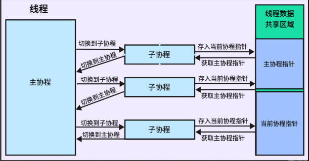

## 协程模块

### 前言知识部分

#### std::atomic
- 在多线程（协程）编程中，当多个线程（协程）同时访问同一块数据时，可能会导致数据竞争和不确定的行为。

```cpp
int counter = 0;
std::mutex mutex;
 
void incrementCounter(){
    for (int i = 0; i < 100000; ++i){
        std::lock_guard<std::mutex> lock(mutex);
        counter++;
    }
}
 
int main(int argc, char** argv){
    std::thread t1(incrementCounter);
    std::thread t2(incrementCounter);
 
    t1.join();
    t2.join();
 
    std::cout << counter << std::endl;
 
    return 0;
}

// 两者都可以保证消除竞争关系

#include <atomic>
 
std::atomic<int> counter(0);
 
void incrementCounter(){
    for (int i = 0; i < 100000; ++i)
    {
        counter++;
    }
}
 
int main(int argc, char** argv){
    std::thread t1(incrementCounter);
    std::thread t2(incrementCounter);
 
    t1.join();
    t2.join();
 
    std::cout << counter << std::endl;
 
    return 0;
}
```

#### ucontext
```cpp
#include <ucontext.h>
// getcontext获取当前上下文
//初始化ucp结构体，将当前的上下文保存到ucp中

int getcontext(ucontext_t *ucp);

// setcontext设置当前上下文
//设置当前的上下文为ucp，setcontext的上下文ucp应该通过getcontext或者makecontext取得，如果调用成功则不返回。
//如果上下文是通过调用getcontext()取得,程序会继续执行这个调用。
//如果上下文是通过调用makecontext取得,程序会调用makecontext函数的第二个参数指向的函数，
//如果func函数返回,则恢复makecontext第一个参数指向的上下文第一个参数指向的上下文context_t中指向的uc_link.
//如果uc_link为NULL,则线程退出。

int setcontext(const ucontext_t *ucp);

// makecontext创建一个新的上下文
//makecontext修改通过getcontext取得的上下文ucp(这意味着调用makecontext前必须先调用getcontext)。
//然后给该上下文指定一个栈空间ucp->stack，设置后继的上下文ucp->uc_link.
//当上下文通过setcontext或者swapcontext激活后，执行func函数，argc为func的参数个数，后面是func的参数序列。
//当func执行返回后，继承的上下文被激活，如果继承上下文为NULL时，线程退出。

void makecontext(ucontext_t *ucp, void (*func)(), int argc, ...);

// swapcontext切换上下文

//保存当前上下文到oucp结构体中，然后激活upc上下文。
//如果执行成功，getcontext返回0，setcontext和swapcontext不返回；
//如果执行失败，getcontext,setcontext,swapcontext返回-1，并设置对于的errno.

int swapcontext(ucontext_t *oucp, ucontext_t *ucp);

```
### 问题部分

#### 1. 什么是IO？为什么需要多线程？
- 很多人会问，为什么需要多个【线程】呢？CPU不是会一直进行处理吗？多个线程的目的是什么呢？
其实如果CPU真的是一直在处理数据的话，我们确实没必要用多个线程，问题在于你要先了解什么是IO。
所谓IO就是输入输出，比如我要一部分信息存储到硬盘中，那么存储需要时间，然而CPU不能直接操作硬盘。
所以出现了一个中转站，CPU会将所有要存储的数据一次性给到中转站，然后CPU可以去忙别的事情（或者等着）。
而中转站会承接这部分任务来将数据存储到硬盘（注意：中转站的存储操作不需要CPU的参与），当存储完成后会通知CPU，让CPU做后续的处理

- 由此我们可以看出：在中转站处理数据的时候，CPU不需要干预，所以此时可以让CPU去处理别的事情，而不是傻傻的等着。写到这里我总感觉悲哀，我们何尝不是这个CPU呢？一直被压榨，没有空闲的时间。

#### 02.到这我们说明了【多线程】的必要性，那么为什么还要【多协程】呢？
1、切换CPU开销：协程上下文切换大概120ns，相对于进程/线程上线文切换所需的3us，大约是其三十分之一。
2、内存开销：协程初始化时为其分配的栈只有2KB，线程10M左右
加之Sylar中的协程可以做到协程栈空间的复用，内存开销会更小！


### 代码分析部分
- 

#### 基本的静态变量
```cpp
/// 线程局部变量，当前线程正在运行的协程
/// t_fiber：保存当前正在运行的协程指针，必须时刻指向当前正在运行的协程对象。协程模块初始化时，t_fiber指向线程主协程对象。
static thread_local Fiber* t_fiber = nullptr;

/// 线程局部变量，当前线程的主协程，相当于切换到了主线程中运行，智能指针的形式
/// 保存线程主协程指针，智能指针形式。协程模块初始化时，t_thread_fiber指向线程主协程对象。
/// 当子协程resume时，通过swapcontext将主协程的上下文保存到t_thread_fiber的ucontext_t成员中，同时激活子协程的ucontext_t上下文。
/// 当子协程yield时，从t_thread_fiber中取得主协程的上下文并恢复运行。
static thread_local Fiber::ptr t_threadFiber = nullptr;
```
- t_fiber : 是当前线程正在运行的协程
- t_threadFiber : 是当前线程的主协程，相当于切换到了主线程中运行，智能指针的形式

#### Fiber类

```cpp
//使用【enable_shared_from_this】需要注意的是：
//1.不可以在MyClass的构造函数中使用shared_from_this()，因为父类的弱针指成员还没有被初始化。
//2.对象直接在栈上或堆上构建，也是不能使用shared_from_this()的，因为常规的构造，不会初始化-父类的弱指针，原理同上。
//3.如果要安全使用shared_from_this(），对象生存至始至终必须由shared_ptr管理，第一个shared_ptr将负责初始化那个父类的弱指针。花了一下午的时间才搞清楚，
//4.使用shared_from_this(）得到的智能指针，显然不是这个对象的第一个智能指针。
class Fiber : public std::enable_shared_from_this<Fiber> {
  friend class Scheduler;

 public:
  typedef std::shared_ptr<Fiber> ptr;

  // 协程状态部分
  enum Status {
    /// 初始化状态：协程刚被创建时的状态
    INIT,
    /// 暂停状态：协程A未执行完被暂停去执行其他协程，需要保存上下文信息
    HOLD,
    /// 执行中状态：协程正在执行的状态
    EXEC,
    /// 结束状态：协程运行结束
    TERM,
    /// 可执行状态
    READY,
    /// 异常状态
    EXCEPT
  };

 private:
 // 将默认构造函数私有，不允许调用默认构造，由此推断出必然有一个自定义的公共有参构造函数
 // ⽆参构造函数只⽤于创建线程的第⼀个协程，也就是线程主函数对应的协程
  Fiber();

 public:
 //自定义公共有参构造,提供回调方法和最大方法调用栈信息层数
 // 有参构造函数，创建⼀个新的协程
 // use_caller: 是指是否使用回收协程机制，默认不使用
  Fiber(std::function<void()> cb, size_t stack_size = 0,
        bool use_caller = false);

// 析构函数
  ~Fiber();

  //重置协程，就是重复利用已结束的协程，复用其栈空间，创建新协程
  // 这个是针对于子协程的
  /// INIT，TERM状态下调用
  void reset(std::function<void()> cb);

  //切换到当前协程执行(一般是由主协程切换到子协程)
  /// 切换到当前协程执行
  void swapIn();

   //切换到后台执行(一般是由子协程切换到主协程)
  /// 切换到后台执行
  void swapOut();

  // 调用Fiber的执行
  //调用指定协程执行
  void call();

  // 协程执行完之后，切换到调度的主协程
  void back();

  uint64_t getId() const { return m_id; }

  Status getState() const { return m_state; }

 public:
  /// 设置当前的协程
  static void SetThis(Fiber* f);
  /// 返回当前的正在执行的协程
  static Fiber::ptr GetThis();
  /// 协程切换到后台，并且设置为Ready状态
  static void YieldToReady();
  /// 协程切换到后台，并且设置为Hold状态
  static void YieldToHold();
  /// 总协程数
  static uint64_t TotalFibers();

  /**
     * 协程执行函数
     * 执行完成返回到线程的主协程
     * */
// 协程的入口函数，用于执行协程的回调函数。
// 在用户传入的协程入口函数上进行了一次封装，这个封装类似于线程模块的对线程入口函数的封装。
  static void MainFunc();

// 专为调度器自身协程设计，直接与线程主协程交互，减少调度器层级的上下文切换开销
  static void CallerMainFunc();

  static uint64_t GetFiberId();

 private:
  //协程ID
  uint64_t m_id = 0;
  //栈大小
  uint32_t m_stacksize = 0;
  //协程状态
  Status m_state = INIT;
  //协程上下文
  ucontext_t m_ctx;
  //协程栈
  void* m_stack = nullptr;
  //协程执行函数
  std::function<void()> m_cb;
};
```
```
- 其中子协程是这么执行它对应的函数的：Fiber::Fiber(std::function<void()> cb) -----> swapin()------> 利用swapcontext将m_ctx放到Scheduler::GetMainFiber()主协程上进行执行，这样就可以直接触发m_cb的执行。
                                                    |
                                                    |
                                            将m_ctx与MainFunc一起绑定起来 ----> 其中MainFunc是一个回调函数，它会调用m_cb
```


