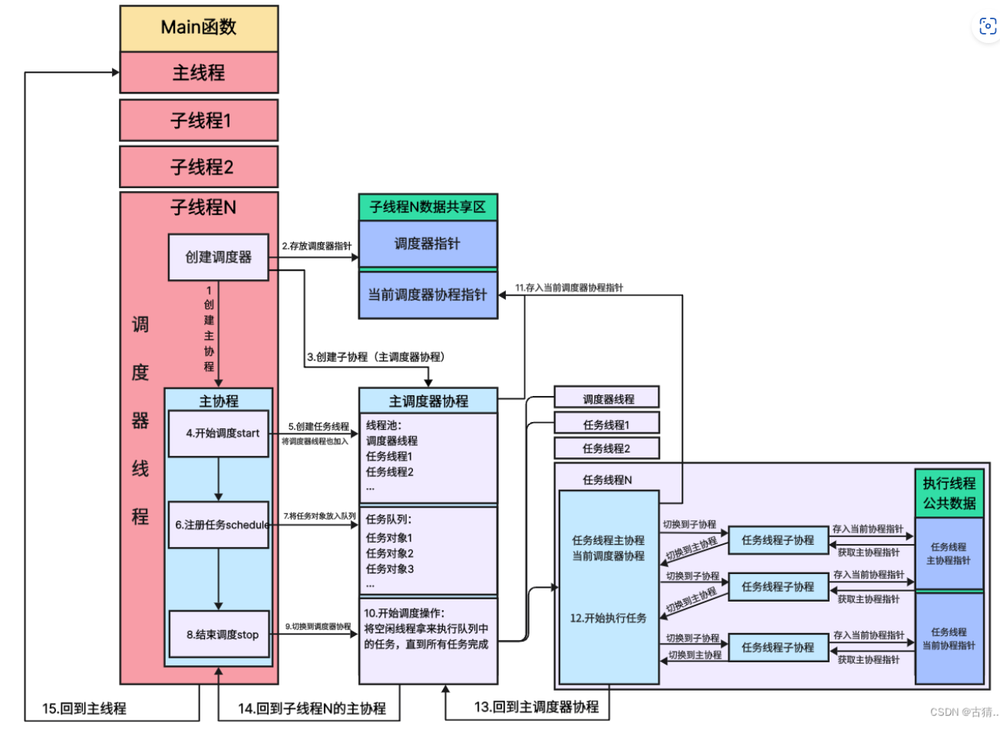
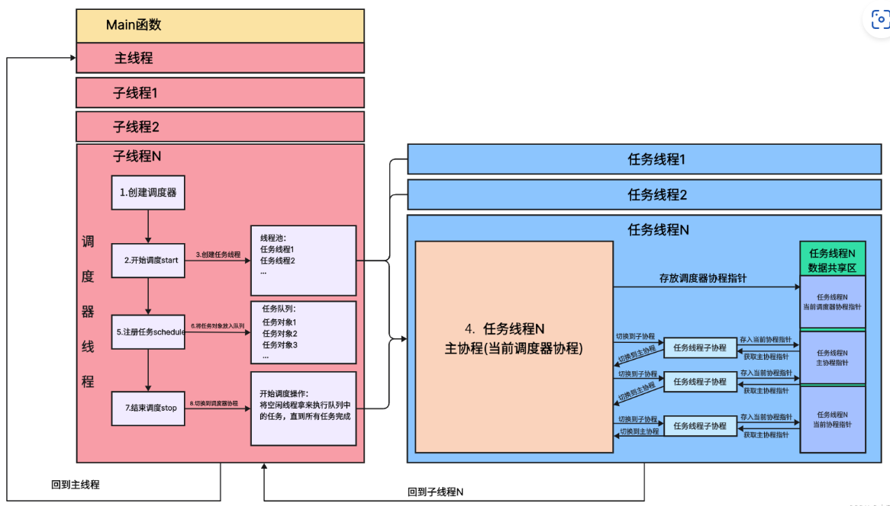
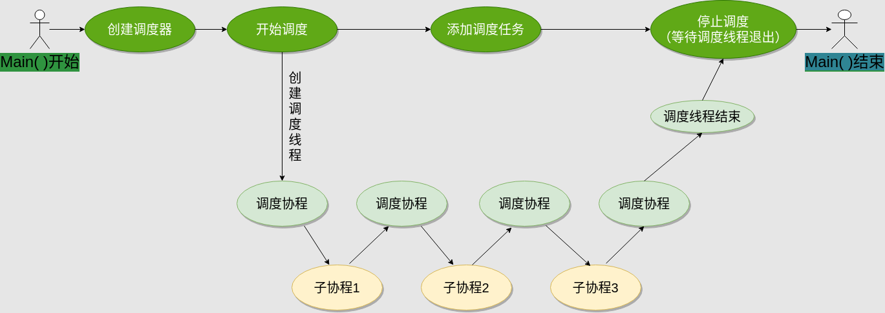
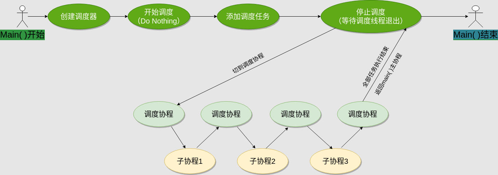
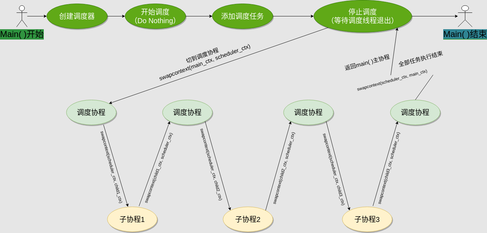

## 协程调度模块

- 调度器所在的线程我称之为： 【调度器线程】。
- 调度器所在的协程我称之为： 【调度器协程】。
- 在调度器线程池中用来执行任务的线程，我称之为： 【任务线程】
- 在调度器中注册的可执行体，我称之为：【任务对象】
- 如果 【任务对象】 是一个协程，我称之为：【协程任务】
- 如果 【任务对象】 是一个函数，我称之为：【函数任务】

```
- 调度任务：对于协程调度来说，协程就是调度任务，但实际上，函数也应可以，因为函数也是可执行的对象，调度器应当支持直接调度一个函数。只需要将函数包装成协程即可轻松实现，协程调度器的实现重点还是以协程为基础。
- 多线程：一个线程同一时刻只能运行一个协程，所以，作为协程调度器，要用到多线程来提高调度的效率，有多个线程就意味着有多个协程可以同时执行，这样就可以提高协程的并发度。
- 在实现相同调度能力的情况下（能够同时调度的协程数量），线程数越小，线程切换的开销也就越小，效率就更高。所以调度器所在的线程，也可以用来执行调度任务。甚至，调度器可以不创建新的线程，而只使用调度器所在的线程（称为caller线程）来进行协程调度，比如只使用main函数所在的线程来进行调度。
- 调度器运行：调度器创建后，内部首先会创建一个调度线程池，调度开始后，所有调度线程按顺序从任务队列里取任务执行，调度线程数越多，能够同时调度的任务也就越多，当所有任务都调度完后，调度线程就停下来等新的任务进来。
- 添加调度任务：添加调度任务就是往调度器的任务队列里塞任务，除此之外，还要有个机制用来通知调度线程有新的任务，因为调度线程并不一定知道有新任务进来了。调度线程也可以不停地轮询有没有新任务，但是这样CPU占用率会很高。
- 调度器停止：调度器应该支持停止调度的功能，以便回收调度线程的资源，只有当所有的调度线程都结束后，调度器才算真正停止。
```

- 协程调度器的大概设计就是：调度器内部维护一个任务队列和一个调度线程池。开始调度后，线程池从任务队列里按顺序取任务执行。调度线程可以包含caller线程。当全部任务都执行完了，线程池停止调度，等待新的任务。添加新任务后，通知线程池有新的任务进来了，线程池重新开始运行调度。停止调度时，各调度线程退出，调度器停止工作。


#### 任务对象
- 【协程任务】：在被执行时会以协程的方式进行执行。
- 【函数任务】：在被执行前会先包装成【协程任务】，然后以协程的方式进行执行。

#### 饿汉调度器 : 如果当前调度器连自己的【调度器线程】都用来执行任务
- 
- 
#### 饱汉调度器 ： 如果当前调度器将自己的【调度器线程】仅用于自身
- 

##### 设计思路
- 1. 首先是协程调度器的初始化。sylar的协程调度器在初始化时支持传入线程数和一个布尔型的use_caller参数，表示是否使用caller线程。在使用caller线程的情况下，线程数自动减一，并且调度器内部会初始化一个属于caller线程的调度协程并保存起来（比如，在main函数中创建的调度器，如果use_caller为true，那调度器会初始化一个属于main函数线程的调度协程）。
- 2. 调度器创建好后，即可调用调度器的schedule方法向调度器添加调度任务，但此时调度器并不会立刻执行这些任务，而是将它们保存到内部的任务队列中。
- 3. 调用start方法启动调度。start方法调用后会创建调度线程池，线程数量由初始化时的线程数和use_caller确定。调度线程一旦创建，就会立刻从任务队列里取任务执行。 > 比较特殊的一点是，如果初始化时指定线程数为1且use_caller为true，那么start方法什么也不做，由caller线程的调度协程来负责调度协程。
- 4. 接下来是调度协程，对应run方法。调度协程负责从调度器的任务队列中取任务执行。取出的任务即子协程，这里调度协程和子协程的切换模型即为非对称模型，每个子协程执行完后都必须返回调度协程，由调度协程重新从任务队列中取新的协程并执行。如果任务队列空了，那么调度协程会切换到一个idle协程，idle协程什么也不做，等有新任务时，idle协程会退出并回到调度协程，重新开始下一轮调度。 >在非caller线程里，调度协程就是调度线程的主协程，但在caller线程里，调度协程相当于caller线程的子协程，这在协程切换时会有大麻烦（是sylar协程调度模块最难理解的地方），这个问题会在下面专门进行讨论。
- 5. 添加调度任务，对应schedule方法，这个方法支持传入协程或函数和线程号参数，表示是否将这个协程或函数绑定到一个具体的线程上执行。如果任务队列为空，那么在添加任务之后，要调用一次tickle方法以通知各调度线程的调度协程有新任务来了。 >在执行调度任务时，可以通过调度器的GetThis方法获取到当前调度器，再通过schedule方法继续添加新的任务，这就变相实现了在子协程中创建并运行新的子协程的功能。
- 6. 停止调度，这里分两种情况讨论。
  - use_caller为false，由于没有使用caller线程进行调度，只需要简单地等各个调度线程里的调度协程退出就行了。
  - use_caller为true，表示caller线程参于调度，这时，调度器初始化时记录的属于caller线程的调度协程就要起作用了，在调度器停止前，应该让这个caller线程的调度协程也运行一次，让caller线程完成调度工作后再退出。如果调度器只使用了caller线程进行调度，那么所有的调度任务要在调度器停止时才会被调度。

##### 调度时的协程切换
- 两种情况
- 1. use_caller为false，对应额外创建一个线程进行协程调度、main函数线程不参与调度的情况。
- 2. use_caller为true，对应只使用main函数所在的线程进行协程调度的情况。
  
###### 1. use_caller为false
- 因为有单独的线程用于协程调度，只需要让新线程的入口函数作为调度协程，从任务队列里取任务执行就行了，main函数与调度协程完全不相关，只需要向调度器添加任务，然后在适当的时机停止调度器即可。当调度器停止时，main函数要等待调度线程结束后再退出，参考下面的图示：
- 

###### 1. use_caller为true
- 由于没有额外的线程进行协程调度，只能用main函数所在的线程来进行调度，梳理一下main函数线程要运行的协程，会发现有以下三类协程：
  - 1. main函数对应的主协程
  - 2. 调度协程。
  - 3. 待调度的任务协程
- 1. main函数主协程运行，创建调度器
- 2. main函数主协程运行，向调度器添加一些调度任务
- 3. 开始协程调度，main函数主协程让出执行权，切换到调度协程，调度协程从任务队列里按顺序执行所有的任务
- 4. 每次执行一个任务，调度协程都要让出执行权，再切到该任务的协程里去执行，任务执行结束后，还要再切回调度协程，继续下一个任务的调度
- 5. 所有任务都执行完后，调度协程还要让出执行权并切回main函数主协程，以保证程序能顺利结束。
- 
- 在具体的实现上，前⾯提到sylar的⼦协程只能和线程主协程切换，⽽不能和另⼀个⼦协程切换。在这个情况下，线程主协程是main函数对应的协程，另外的两类协程，也就是调度协程和任务协程，都是子协程，也就是说，调度协程不能直接和任务协程切换，一旦切换，程序的main函数协程就跑飞了。
  - 解决单线程环境下caller线程主协程-调度协程-任务协程之间的上下文切换，是sylar协程调度实现的关键。
  - 其实，子协程和子协程之间的切换导致线程主协程跑飞的关键原因在于，每个线程只有两个线程局部变量用于保存当前的协程上下文信息。也就是说线程任何时候都最多只能知道两个协程的上下文，一个是当前正在运行协程的上下文，另一个是线程主协程的上下文。如果子协程和子协程切换，那这两个上下文都会变成子协程的上下文，线程主协程的上下文就丢失了，程序也就跑飞了。如果不改变这种局面，就只能线程主协程去充当调度协程，这就相当于又回到了让用户充当调度器的情况。
  - 要改变这种情况其实非常简单，只需要给每个线程增加一个线程局部变量用于保存调度协程的上下文就可以了，这样，每个线程可以同时保存三个协程的上下文，一个是当前正在执行的协程上下文，另一个是线程主协程的上下文，最后一个是调度协程的上下文。有了这三个上下文，协程就可以根据自己的身份来选择和每次和哪个协程进行交换，具体操作如下：
    - 1. 给协程类增加一个bool类型的成员m_runInScheduler，用于记录该协程是否通过调度器来运行。
    - 2. 创建协程时，根据协程的身份指定对应的协程类型，具体来说，只有想让调度器调度的协程的m_runInScheduler值才为true，线程主协程和线程调度协程的m_runInScheduler都为false。
    - 3. resume一个协程时，如果如果这个协程的m_runInScheduler值为true，表示这个协程参与调度器调度，那它应该和三个线程局部变量中的调度协程上下文进行切换，同理，在协程yield时，也应该恢复调度协程的上下文，表示从子协程切换回调度协程；
      - 4. 如果协程的m_runInScheduler值为false，表示这个协程不参与调度器调度，那么在resume协程时，直接和线程主协程切换就可以了，yield也一样，应该恢复线程主协程的上下文。m_runInScheduler值为false的协程上下文切换完全和调度协程无关，可以脱离调度器使用。
- 经过上面的改造，就可以解决单线程环境下caller线程主协程-调度协程-任务协程之间的上下文切换问题了，假设caller线程主协程的上下文为main_ctx，调度协程的上下文为scheduler_ctx，任务协程上下文为child_ctx，那么单线程下的协程切换将像下面这样：
- 

```cpp
// 定义
static sylar::Logger::ptr g_logger = SYLAR_LOG_NEAME("system");
// 实例化一个当前线程的调度器，同一个调度器下的所有线程共享一个调度器
static thread_local Scheduler* t_scheduler = nullptr;
// 当前线程的调度协程，每个线程都独有一份，包括caller线程
static thread_local Fiber* t_sheduler_fiber = nullptr;
// t_scheduler_fiber保存当前线程的调度协程，加上Fiber模块的t_fiber和t_thread_fiber，每个线程总共可以记录三个协程的上下文信息。
```

- 成员变量：
```cpp
std::string m_name;                                 /// 调度器名称
MutexType m_mutex;                                  /// 互斥锁
std::vector<Thread::ptr> m_threads;                 /// 线程池
std::list<ScheduleTask> m_tasks;                    /// 任务队列
std::vector<int> m_threadIds;                       /// 线程池线程id数组
size_t m_threadCount = 0;                           /// 工作线程数量，不包括use_caller主线程
std::atomic<size_t> m_activeThreadCount = {0};      /// 活跃的线程数量
std::atomic<size_t> m_idleThreadCount = {0};        /// idle线程数量

bool m_useCaller;                                   /// 是否use caller
int m_rootThread = 0;                               /// use_caller为true时，调度器所在线程的id
Fiber::ptr m_rootFiber;                             /// use_caller为true时，调度器所在线程的调度协程
bool m_stopping = false;                            /// 是否正在停止    
```

