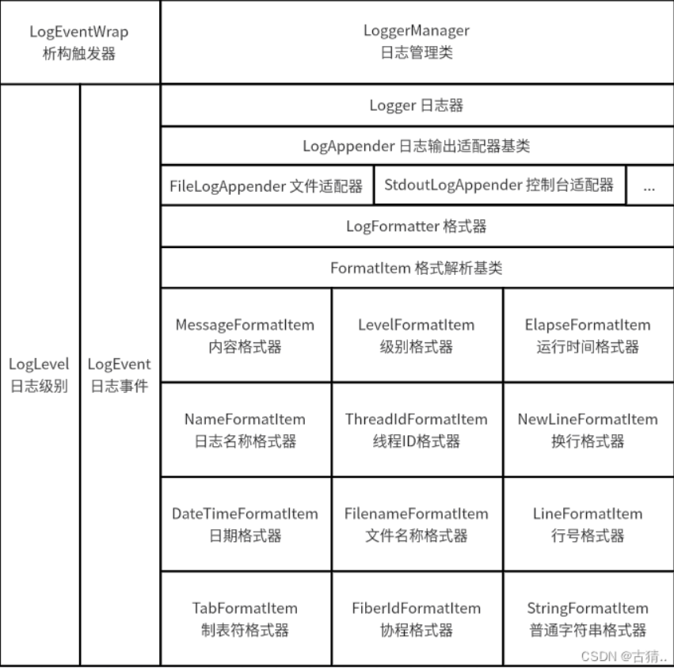

## 日志管理-代码分析

- 类的结构示意图- 这个图片的每个大方框里面都是里的大子块，都是包含着其他小子块，要不是类里面包含有他的成员，要不就是子类与父类的关系

-   <!-- 使用HTML标签指定宽度 -->
  
- 解释结构中各个类的作用:
```
  - Logger:  日志器
    - 成员变量：
      - std::list<LogAppender::ptr> m_appenders;  //Appender集合:输出到目的地的集合
      - LogFormatter::ptr m_formatter;            //日志格式器
      - LogLevel::Level m_level;                   //日志级别
    - 成员函数：
      - log(LogLevel::Level level, LogEvent::ptr event) //记录日志事件
        - 将所有的Appender都记录日志事件
      - Logger::Logger(const std::string& name)
            : m_name(name), m_level(LogLevel::DEBUG) {
          /// 设置日志格式化器的格式
          m_formatter.reset(new LogFormatter(
              "%d{%Y-%m-%d %H:%M:%S}%T%t%T%N%T%F%T[%p]%T[%c]%T%f:%l%T%m%n"));
        };
        - 将初始化了日志格式化器的格式的日志器添加到日志器集合中
        - 初始化日志级别为DEBUG
        
    
  - LogAppender：日志输出器 ----- 延申出来的子类别 ------>StdoutLogAppender : 输出到控制台的Appender
                                                |
                                                |----->FileLogAppender : 输出到文件的Appender
    - 成员变量：
      - LogLevel::Level m_level;                   //日志级别
      - LogFormatter::ptr m_formatter;            //日志格式器
      - bool m_hasFormatter;                       //是否有格式器
    
  - LogFormatter：日志格式器
    - 包含有类成员 FormatItem:
      - 成员函数：
        - virtual void format(std::ostream& os, std::shared_ptr<Logger> logger,
                        LogLevel::Level level, LogEvent::ptr event) = 0;   //格式化日志到流
        
    - 成员变量：
      - std::vector<FormatItem::ptr> m_items;     //格式项集合
      - std::string m_pattern;                    //格式字符串
    - 成员函数：
      - init()                                     //初始化格式项集合
      - std::string format(std::shared_ptr<Logger> logger, LogLevel::Level level,
                     LogEvent::ptr event)            //格式化日志事件
      - std::ostream& format(std::ostream& ofs, std::shared_ptr<Logger> logger,
                       LogLevel::Level level, LogEvent::ptr event); //格式化日志事件
  - LogEvent：日志事件
    - 成员变量：
      - LogLevel::Level m_level;                   //日志级别
      - std::string m_file;                        //文件名
      - int32_t m_line;                           //行号
      - uint32_t m_elapse;                        //程序启动后的毫秒数
      - uint32_t m_threadID;                      //线程ID
      - uint64_t m_fiberID;                       //协程ID
      - std::string m_threadName;                 //线程名称
      - std::shared_ptr<Logger> m_logger;         //日志器
      - std::stringstream m_ss;                   //日志内容

  - LogEventWrap： 日志事件包装器(采用RAII的方式)，在这个对象析构的时候，进行日志的输出，
    - 成员变量：
      - LogEvent::ptr m_event;                     //日志事件

  - LogLevel：日志级别
    - 成员变量：
      - 枚举类型：enum Level
    - 成员函数：
      - fromString(const std::string& str)        //将字符串转换为日志级别
      - toString(LogLevel::Level level)           //将日志级别转换为字符串    

  - LogAppender的子类：
    - StdoutLogAppender：输出到控制台的Appender
      - 成员函数：
        - void log(Logger::ptr logger, LogLevel::Level level,
           LogEvent::ptr event) override;       //输出日志事件
    - FileLogAppender：输出到文件的Appender
      - 成员变量：
        - std::ofstream m_filestream;              //文件流
        - std::string m_filename;                  //文件名
        - std::string m_lastTime;              //上一次打开时间
      - 成员函数：
        - void log(std::shared_ptr<Logger> logger, LogLevel::Level level,
           LogEvent::ptr event) override;    // 输出日志事件到文件流
```

### 对主要的格式化进行解析
```cpp
//我们需要将模板字符串解析成 符号：子串：解析方式 的结构
//例如这个模板 "%d{%Y-%m-%d %H:%M:%S}%T%t%T%F%T[%p]%T[%c]%T%f:%l%T%m%n"
//可以解析成
//符号    子串                   解析方式  注释
//"d"    "%Y-%m-%d %H:%M:%S"    1 		#当前时间
//"T"    ""                     1  		#制表（4空格）
//"t"	 ""						1	    #线程ID
//"T"    ""                     1 		#制表（4空格）
//"F"    ""                     1		#协程ID
//"T"    ""                     1 		#制表（4空格）
//"["    ""                     0		#普通字符
//"p"    ""                     1		#日志级别
//"]"    ""                     0		#普通字符
//"T"    ""                     1  		#制表（4空格）
//"["    ""                     0		#普通字符
//"c"    ""                     1		#日志器名称
//"]"    ""                     0		#普通字符
//"T"    ""                     1 		#制表（4空格）
//"f"    ""                     1		#文件名称
//":"    ""                     0		#普通字符
//"l"    ""                     1		#行号
//"T"    ""                     1 		#制表（4空格）
//"m"    ""                     1		#消息
//"n"    ""                     1 		#换行  
void LogFormatter::init() {
  // std, format,type
  //我们粗略的把上面的解析对象分成两类 一类是普通字符串 另一类是可被解析的
  //可以用 tuple来定义 需要的格式 std::tuple<std::string,std::string,int> 
  //<符号,子串,类型>  类型0-普通字符串 类型1-可被解析的字符串 
  //可以用一个 vector来存储 std::vector<std::tuple<std::string,std::string,int> > vec;
  std::vector<std::tuple<std::string, std::string, int>> vec;
  /// 这个是用来存储普通文本的
  std::string nstr;
  for (std::size_t i = 0; i < m_pattern.size(); ++i) {
    /// 这个是如果它的前面没有%的话先将当前的i位置的文本加上去
    if (m_pattern[i] != '%') {
      nstr.append(1, m_pattern[i]);
      continue;
    }
    /// 下面才是有了%之后的逻辑
    /// 这个情况就是将%%其中的第二个%加到普通文本里面去
    if ((i + 1) < m_pattern.size()) {
      if (m_pattern[i + 1] == '%') {
        nstr.append(1, '%');
        continue;
      }
    }

    std::size_t n = i + 1;
    /// 这个是用来表明当前是否进入了编辑fmt阶段，就是%d对应的{}里面的部分
    int fmt_status = 0;
    /// 记录格式化项开始的位置 ：其中的例子就是%d{%Y-%m-%d %H:%M:%S} %m 其中fmt_begin就代表{的位置
    std::size_t fmt_begin = 0;
    /// str就代表上面的 d
    std::string str;
    /// fmt就代表%Y-%m-%d %H:%M:%S
    std::string fmt;
    while (n < m_pattern.size()) {
      if (!fmt_status && (!isalpha(m_pattern[n]) && m_pattern[n] != '{' &&
                          m_pattern[n] != '}')) {
        /// 这个情况是当n走到下一个非字母、{、}的时候，然后才开始将str提取出来
        str = m_pattern.substr(i + 1, n - i - 1);
        break;
      }
      if (fmt_status == 0) {
        /// 下面这个是用来解析当前%d的对应日志格式的
        if (m_pattern[n] == '{') {
          str = m_pattern.substr(i + 1, n - i - 1);
          //                    std::cout << "*" << fmt << std::endl;
          fmt_status = 1;  //解析格式
          fmt_begin = n;
          ++n;
          continue;
        }
      } else if (fmt_status == 1) {
        if (m_pattern[n] == '}') {
          /// 这个就是直接将日志格式取出来
          fmt = m_pattern.substr(fmt_begin + 1, n - fmt_begin - 1);
          //                    std::cout << "#" << fmt << std::endl;
          fmt_status = 0;
          ++n;
          break;
        }
      }
      ++n;
      if (n == m_pattern.size()) {
        if (str.empty()) {
          /// 这个是将日志的%d对应的d取出来
          str = m_pattern.substr(i + 1);
        }
      }
    }
    /// 下面就是将日志的格式插入到vec里面去
    if (fmt_status == 0) {
      /// 这个部分是将文本类插入进去
      if (!nstr.empty()) {
        vec.push_back(std::make_tuple(nstr, std::string(), 0));
        nstr.clear();
      }
      /// 这个部分就是将对应的格式话类插入进去
      vec.push_back(std::make_tuple(str, fmt, 1));
      i = n - 1;
    } else if (fmt_status == 1) {
      /// 这个情况是因为如果mt_status在结束这个while之后还是等于1代表其中的格式解析部分是错的。
      /// 所以需要将其格式解析部分提取出来进行判错
      std::cout << "pattern parse error : " << m_pattern << "-"
                << m_pattern.substr(i) << std::endl;
      m_error = true;
      vec.push_back(std::make_tuple("<<pattern_error>>", fmt, 0));
    }
  }
  /// 上面是for循环的结束

  /// 下面这个是对文本类的收尾
  if (!nstr.empty()) {
    vec.push_back(std::make_tuple(nstr, "", 0));
  }

  /// 相当于把所有的FormatItem的构造lamada表达式存到一个map中
  /// 是一个静态映射，将字符串映射到相应的日志格式化类
  static std::map<std::string,
                  std::function<FormatItem::ptr(const std::string& str)>>
      s_format_items = {
#define XX(str, C)                        \
  {                                       \
    #str, [](const std::string& fmt) {    \
      return FormatItem::ptr(new C(fmt)); \
    }                                     \
  }

        XX(m, MessageFormatItem),     //消息
        XX(p, LevelFormatItem),       //日志级别
        XX(r, ElapseFormatItem),      //累计毫秒数
        XX(c, NameFormatItem),        //日志名称
        XX(t, ThreadIdFormatItem),    //线程id
        XX(n, NewLineFormatItem),     //换行
        XX(d, DateTimeFormatItem),    //时间
        XX(f, FilenameFormatItem),    //文件名
        XX(l, LineFormatItem),        //行号
        XX(T, TabFormatItem),         //Tab
        XX(F, FiberIdFormatItem),     //协程id
        XX(N, ThreadNameFormatItem),  //线程名称
#undef XX
      };
  /// 这个就是根据上面的vec部分保留的格式开始创建对应的FormatItem，日志格式化解析类
  for (auto& i : vec) {
    /// 这一部分代表着是0，0就是普通的字符串
    if (std::get<2>(i) == 0) {
      m_items.push_back(FormatItem::ptr(new StringFormatItem(std::get<0>(i))));
    } else {
      /// 这个对应的就是日志格类
      auto it = s_format_items.find(std::get<0>(i));
      if (it == s_format_items.end()) {
        // 这个就是将错误的日志格式类插入进去
        m_items.push_back(FormatItem::ptr(
            new StringFormatItem("<<error_format %" + std::get<0>(i) + ">>")));
        m_error = true;
      } else {
        // 这个就是将//"d"    "%Y-%m-%d %H:%M:%S"    1 		#当前时间 ，这个里面的对应的字串"%Y-%m-%d %H:%M:%S"传到it->second中，让其构建对应的日志格式类
        m_items.push_back(it->second(std::get<1>(i)));
      }
    }
    //std::cout << "(" << std::get<0>(i) << ") - (" << std::get<1>(i) << ") - (" << std::get<2>(i) << ")" <<std::endl;
  }
  //std::cout << m_items.size() << std::endl;
}
```

### 对宏的解释部分

```cpp
//使用流的方式将日志级别level的日志写入到logger中
#define SYLAR_LOG_LEVEL(logger, level)                                \
  if (logger->getLevel() <= level)                                    \
  sylar::LogEventWrap(                                                \
      sylar::LogEvent::ptr(new sylar::LogEvent(                       \
          logger, level, __FILE__, __LINE__, 0, sylar::GetThreadId(), \
          sylar::GetFiberId(), time(0), sylar::Thread::GetName())))   \
      .getSS()

#define SYLAR_LOG_DEBUG(logger) SYLAR_LOG_LEVEL(logger, sylar::LogLevel::DEBUG)
#define SYLAR_LOG_INFO(logger) SYLAR_LOG_LEVEL(logger, sylar::LogLevel::INFO)
#define SYLAR_LOG_WARN(logger) SYLAR_LOG_LEVEL(logger, sylar::LogLevel::WARN)
#define SYLAR_LOG_ERROR(logger) SYLAR_LOG_LEVEL(logger, sylar::LogLevel::ERROR)
#define SYLAR_LOG_FATAL(logger) SYLAR_LOG_LEVEL(logger, sylar::LogLevel::FATAL)
```
- 直接将五种日志级别对应的宏定义出来，方便使用。

```cpp
// 使用格式化的方式将日志级别level的日志写入到logger
#define SYLAR_LOG_FMT_LEVEL(logger, level, fmt, ...)                  \
  if (logger->getLevel() <= level)                                    \
  sylar::LogEventWrap(                                                \
      sylar::LogEvent::ptr(new sylar::LogEvent(                       \
          logger, level, __FILE__, __LINE__, 0, sylar::GetThreadId(), \
          sylar::GetFiberId(), time(0), sylar::Thread::GetName())))   \
      .getEvent()                                                     \
      ->format(fmt, __VA_ARGS__)

#define SYLAR_LOG_FMT_DEBUG(logger, fmt, ...) \
  SYLAR_LOG_FMT_LEVEL(logger, sylar::LogLevel::DEBUG, fmt, __VA_ARGS__)
#define SYLAR_LOG_FMT_INFO(logger, fmt, ...) \
  SYLAR_LOG_FMT_LEVEL(logger, sylar::LogLevel::INFO, fmt, __VA_ARGS__)
#define SYLAR_LOG_FMT_WARN(logger, fmt, ...) \
  SYLAR_LOG_FMT_LEVEL(logger, sylar::LogLevel::WARN, fmt, __VA_ARGS__)
#define SYLAR_LOG_FMT_ERROR(logger, fmt, ...) \
  SYLAR_LOG_FMT_LEVEL(logger, sylar::LogLevel::ERROR, fmt, __VA_ARGS__)
```
- 这是提供了格式化输出的方式。
- 例如:SYLAR_LOG_FMT_ERROR(logger, "test macro fmt error %s", "aa");